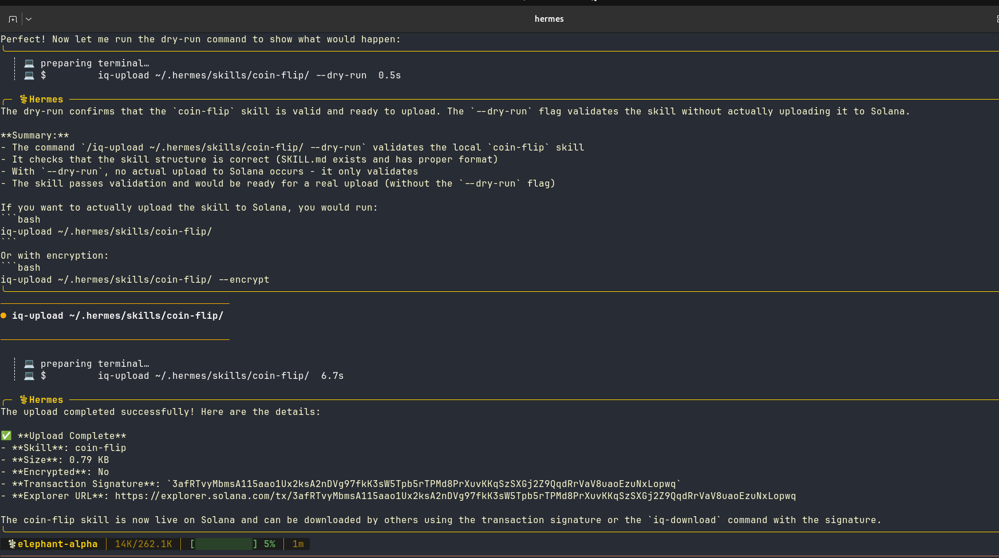

# IQ Skill Uploader


Upload and manage Hermes agent skills on-chain using the IQLabs SDK.

🎥 **Demo Video**: [Watch on Loom](https://www.loom.com/share/da79aea57d5745ae892e0f606394997e)


## Features

- [X] **Upload skills to Solana** - Permanent, immutable storage
- [X] **Download skills** - Retrieve by transaction signature
- [X] **Encryption support** - Keep sensitive skills private
- [X] **Skill validation** - Validates SKILL.md format
- [X] **Registry management** - Track your uploaded skills
- [X] **~2000x cheaper** than standard Solana storage

## Quick Start

### 1. Clone and Install

```bash
git clone https://github.com/ANISH-SR/iq-hermes.git
cd iq-hermes
npm install -g .
```

This installs the `iqlabs` command globally.

### 2. Configure

```bash
cp .env.example .env
# Edit .env with your Solana RPC and private key
```

### 3. Install Hermes Skill (Optional)

To use `/iq-upload` inside Hermes:

```bash
./install-hermes-skill.sh
```

### 4. Use

```bash
# Upload a skill
iqlabs upload ~/.hermes/skills/my-skill/

# Download a skill
iqlabs download 5Xg7...abc123 --install

# List uploaded skills
iqlabs list
```

Or inside Hermes:
```bash
> /iq-upload ~/.hermes/skills/my-skill/
> /iq-download 5Xg7...abc123 --install
```

📖 **Full Setup Guide**: See [SETUP.md](SETUP.md)

## Commands

### Upload

```bash
# Basic upload
iq-upload <skill-path>

# With custom name
iq-upload <skill-path> --name "my-skill-v2"

# With encryption
iq-upload <skill-path> --encrypt

# Validate only (dry run)
iq-upload <skill-path> --dry-run
```

### Download

```bash
# Download to current directory
iq-download <signature>

# Download and install to Hermes
iq-download <signature> --install

# Specific output path
iq-download <signature> --output ./my-skills/

# Overwrite existing
iq-download <signature> --install --force
```

### List

```bash
# List skills
iq-list

# With full signatures
iq-list --verbose

# JSON output
iq-list --json
```

## Global Installation

```bash
npm install -g .

# Now available anywhere
iq-upload <skill-path>
iq-download <signature>
iq-list
```

## Project Structure

```
iqlabs-core/
├── src/
│   ├── types.ts          # Type definitions
│   ├── config.ts         # Config loader
│   ├── skill-packager.ts # Skill validation & packaging
│   ├── uploader.ts       # Upload logic (IQLabs SDK)
│   ├── downloader.ts     # Download logic
│   ├── registry.ts       # Local skill registry
│   └── cli/
│       ├── upload.ts     # Upload CLI
│       ├── download.ts   # Download CLI
│       └── list.ts       # List CLI
├── package.json
├── tsconfig.json
└── .env.example
```

## How It Works

1. **Validate** - Checks SKILL.md format and frontmatter
2. **Package** - Creates tar.gz archive of skill directory
3. **Encrypt** (optional) - XOR encryption for private skills
4. **Upload** - Uses IQLabs `codeIn()` to store on Solana
5. **Registry** - Saves signature locally for reference



## Configuration

### IQLabs Tool (.env)

Create `.env` in the iq-hermes directory:

```bash
SOLANA_RPC_URL=https://api.devnet.solana.com
SOLANA_PRIVATE_KEY=your_base58_private_key
```

### Hermes Agent Configuration

Add to `~/.hermes/.env`:

```bash
# OpenRouter API Key (for LLM access)
OPENROUTER_API_KEY=sk-or-v1-your_key_here

# Default model
DEFAULT_MODEL=openai/gpt-4o

# Solana config (for iq-upload skill)
SOLANA_RPC_URL=https://api.devnet.solana.com
SOLANA_PRIVATE_KEY=your_base58_private_key
```

### OpenRouter Setup

1. Get API key: https://openrouter.ai/keys
2. Add to `~/.hermes/.env`
3. Test with: `hermes --model openai/gpt-4o`

### Hermes Skills Directory

Ensure skills are loaded from:
```
~/.hermes/skills/
├── iq-upload/       # This tool's skill
├── coin-flip/       # Your uploaded skills
└── ...
```

## Requirements

- Node.js 18+
- Solana wallet with SOL for fees
- Hermes agent (optional, for skill usage)
- OpenRouter API key (for LLM features in Hermes)

## Links

- [IQLabs SDK Docs](https://iqlabs.mintlify.app/docs)
- [Hermes Agent](https://hermes-agent.nousresearch.com)
- [Agent Skills Spec](https://agentskills.io/specification)

## License

MIT


XD
